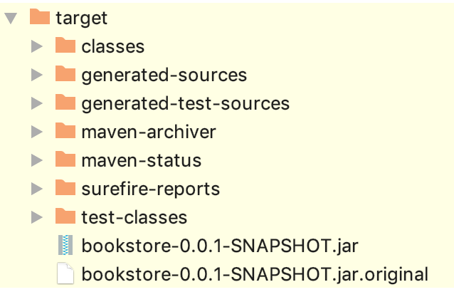

#  Documenting Your Code

## Learning Objectives

*After this lesson, students will be able to:*

- Explain why documentation is important. 
- Describe common approaches to generating accurate and readable documentation for Java code and REST APIs. 

## Lesson Guide

| TIMING  | TYPE  | TOPIC  |
|:-:|---|---|
| 5 min   | Opening | Lesson Objectives |
| 10 min  | Lecture  | Comments in Code |
| 20 min  | Independent Practice | Code Comment Activity |
| 20 min  | Lecture  | Embedded Annotations |
| 5 min   | Conclusion  | Review/Recap |

----

## Opening (5 min)

> _"Indeed, the ratio of time spent reading versus writing is well over 10 to 1. We are constantly reading old code as part of the effort to write new code. ...[Therefore,] making it easy to read makes it easier to write."_
    — Robert C. Martin, [Clean Code: A Handbook of Agile Software Craftsmanship](https://www.amazon.com/Clean-Code-Handbook-Software-Craftsmanship-ebook/dp/B001GSTOAM)

In addition to writing **clean code**, accurate, complete, and readable **documentation** is key to helping others (and let's face it, your future self) understand the code. 

Easily understandable code also helps to maintain and enhance an existing application. Good documentation should be accurate, complete, and concise and easy to access, navigate, and read. 

Methods of documentation include: 
- Comments in code 
- Embedded annotations

---

## Comments in Code (10 min) 

> *"A comment is a failure to express yourself in code. If you fail, then write a comment; but try not to fail."* 
    - [Bob Martin](https://twitter.com/unclebobmartin/status/870311898545258497?lang=en)

Comments in code can explain _intent_. 

Comments help demonstrate in plain language what the original developer was thinking when they wrote the code, as well as how the code was derived. Knowing this kind of information can save us a lot of time and frustration when debugging and/or extending the codebase.

**So, how do we do it?**

> **Knowledge Check**: What do single- and multi-line comments look like in Java?

1. Add two forward slashes to comment out what follows them on a single line of code:

    ```java 
    
    // This is a comment.
    List<Integer> list = new ArrayList<~>();
     
    // This is another comment.
    myComponent.doSomething(list);  
    ```

2. For multi-line comments, enclose your content in `/* or /** followed by */`:

    ```java
    /*
     This is a comment 
       on multiple lines
       of code.
    */    
    ```

    ```java
    /**
     * This is also a multi-line comment, but 
     *  it can be parsed by a tool called Javadoc to create pretty documentation 
     *  for your classes, with details about methods, arguments, return values, 
     *  exceptions, and more. You can also embed snippets of HTML.  
     */     
    ```

An eternal question for developers is **what should and should not be commented.** 

> **Knowledge Check**: What are some challenges with comments? 

It's just as easy to abuse and overdo comments as it is to leave them out entirely. Comments should not be a substitute for writing clear and descriptive class, method, and variable names. Moreover, there can be overhead in keeping comments updated; we've all created comments for things like TODOs and then forgot about them!  

----    
    
## Activity: Code Comments (20 min) 

In this exercise, you're going to go through the pain of having to read and parse uncommented code.

Find a recent Java lab or project you worked on. It should be a file with no (or very few) comments. Once you've found something, find a partner and swap uncommented code files.

Take a few minutes to review your partner's code. As you're reading it, figure out:
- What the program is doing.
- Why it was built in the way that it was.
- Any dependencies it may have.

When you're done, share your findings with your partner — the original author of the code you reviewed. Was it easy to figure out what was going on? What questions do you have about their choices or the purpose of the program?

**Bonus**
- If you still have time, go into your code file and add comments. 
- Think about places where your partner was confused and how you could address their questions.

----

## Embedded Annotations (20 min)

In addition to documenting the internal workings of your code with comments, it's important to document *interfaces* for your code so that other developers know *how* to use the class or service (e.g., REST APIs) you've built. 

Your documentation should explain:
- How the interface is supposed to be called. 
- What the expected arguments are, along with their types.
- What to expect in response (including exceptions/errors).

**So, how do we do it?**

Unlike comments in code that just require a few characters (`//`), you'll need to use a tool to document interfaces for your code. 

1) [Javadoc](https://docs.oracle.com/javase/8/docs/technotes/tools/windows/javadoc.html) can be used to document how to use classes.
2) [Swagger](https://en.wikipedia.org/wiki/Swagger_(software) (an implementation of the [OpenAPI spec](https://en.wikipedia.org/wiki/OpenAPI_Specification)) can be used to document how to use the REST APIs that your back-end application or microservice exposes to clients.

### Javadoc

Here's an example of the Javadoc for a class with one method ([source](https://en.wikipedia.org/wiki/Javadoc)):

```java

/**
 * @author      Firstname Lastname <address @ example.com>
 * @version     1.6                 (current version number of program)
 * @since       1.2          (the version of the package this class was first added to)
 */
public class MyClassyClass {


    /**
     * Short one line description.                           (1)
     * <p>
     * Longer description. If there were any, it would be    (2)
     * here.
     * </p>
     * And even more explanations to follow in consecutive
     * paragraphs separated by HTML paragraph breaks.
     *
     * @param  variable Description text text text.          (3)
     * @return Description text text text.
     * 
     * @see <a href="https://en.wikipedia.org/wiki/Javadoc">Javadoc on Wikipedia</a>
     */
    public int methodName (int variable) {
        // method body with a return statement
        return variable * 2;
    }
}

```

> **Knowledge Check**: What do you notice about this code? What's going on here?

Here's an example of what the HTML output from running the ``javadoc`` tool looks like for a different example (class ``SuperHero``). 


*Source: [Introduction to Javadoc: Baeldung](https://www.baeldung.com/javadoc)*


## Code Along: Javadoc (30 min)

This is a simple bookstore app. Grab the [starter code](./starter-code) before we begin.

As a starting point, we'll build our bookstore application as-is:

```sh 
    cd starter-code
    ./mvnw clean package    
```
    
 We'll add documentation incrementally in the steps that follow.
 
 In your `target` directory, you should see this content:
    

      
Let's generate some Javadoc. Run this command:

```sh 
    ./mvnw javadoc:javadoc
```
    
Now, let's have a look at the overall documentation:
    
```sh    
    open target/site/apidocs/index.html
```

Here's the `Book` class specifically:
    
```sh 
    open target/site/apidocs/co/ga/bookstore/Book.html
```

Notice how the structure of the application is documented but there aren't any descriptions? Let's write descriptions for some of our classes.
        
Add the Javadoc comments below to your [Book](./starter-code/bookstore/src/main/java/co/ga/bookstore/Book.java) class. (Note: These comments are incomplete for now.)

```java 
    package co.ga.bookstore;
    
    import javax.persistence.Entity;
    import javax.persistence.GeneratedValue;
    import javax.persistence.GenerationType;
    import javax.persistence.Id;
    
    /**
     * Book entity to represent books in our data model. A book has a title. 
     * We'll be able to search for books by title in {@link BookRepository}.
     *
     * @author alex
     */
    @Entity
    public class Book {
    
        @Id
        @GeneratedValue(strategy=GenerationType.AUTO)
        private Long id;
        private String title;
    
        /**
         * The default constructor.
         */
        public Book() {
        }
    
        /**
         * Constructor with title as an argument
         * @param title the title for this book
         */
        public Book(String title) {
            this.title = title;
        }
      
        public Long getId() {
            return id;
        }
    
        public void setId(Long id) {
            this.id = id;
        }
    
        public String getTitle() {
            return title;
        }
    
        public void setTitle(String title) {
            this.title = title;
        }

        @Override
        public String toString() {
            return "Book{" +
                    "id=" + id +
                    ", title='" + title + '\'' +
                    '}';
        }
    }    
```   
    
Now, re-run the Maven Javadoc plugin and review the documentation for the `Book` class:

```sh 
    ./mvnw javadoc:javadoc    
    open target/site/apidocs/co/ga/bookstore/Book.html
```
 
See the nice comments now?

## You Do

Add the rest of the Javadoc comments to the `Book` class.
 
## Conclusion (5 min)

Before we move to Swagger, let's discuss a few wrap-up questions:

- Why is documentation important?
- What are some ways to include documentation for Java code? 

## Additional Reading

- [/** and /* in Java Comments - StackOverflow](https://stackoverflow.com/questions/29815636/and-in-java-comments)

